# Simple Voting dApp 

## Deskripsi

Simple Voting dApp adalah aplikasi voting berbasis blockchain yang memungkinkan pengguna melakukan pemungutan suara secara transparan dan terdesentralisasi menggunakan smart contract Ethereum. Aplikasi ini menggunakan MetaMask sebagai wallet untuk autentikasi pengguna dan memastikan setiap wallet hanya dapat melakukan satu kali voting.

Use case dari aplikasi ini adalah untuk simulasi pemilihan ketua organisasi, voting komunitas, atau pengambilan keputusan secara transparan menggunakan teknologi blockchain.

---

## Anggota Kelompok

| Nama             | NRP   | Kontribusi                 |
| ---------------- | ----- | -------------------------- |
| Michael Laurence Djie | 5006231001 | Smart Contract Development |
| Muhammad Harisul Haq | 5006231028 |  Web3 Integration & Testing  |
| Evand Khan | 5006231003 | Frontend UI/UX Development |

---

## Tech Stack

* Frontend: React + Vite
* Smart Contract: Solidity + Hardhat
* Web3 Library: ethers.js
* Wallet: MetaMask
* Testing: Mocha + Chai

---

## Fitur

### Wallet Features

* Connect MetaMask Wallet
* Display Connected Account
* Network Detection (Hardhat Localhost)

### Read Operations

* Menampilkan daftar kandidat
* Menampilkan jumlah vote setiap kandidat

### Write Operations

* Menambahkan kandidat (Owner Only)
* Melakukan voting kandidat

### Security Features

* Hanya owner yang dapat menambah kandidat
* Setiap wallet hanya dapat melakukan satu kali voting
* Validasi kandidat yang dipilih
* Validasi deadline voting

### User Experience

* Loading state saat transaksi diproses
* Error handling untuk transaksi gagal
* Responsive design untuk desktop dan mobile

---

## Smart Contract Features

### State Variables

* owner
* deadline
* candidates
* hasVoted

### Functions

* getOwner()
* addCandidate()
* vote()
* getCandidate()
* candidateCount()

### Modifier

* onlyOwner

### Events

* CandidateAdded
* Voted

### Mapping

* hasVoted

---

## Cara Menjalankan

### Prerequisites

* Node.js v18+
* MetaMask Browser Extension
* Git

### 1. Clone Repository

```bash
git clone [https://github.com/Haris0474/blockchain-project3-team-cireng.git]
cd blockchain-project3-team-cireng
```

### 2. Install Dependencies

Root project:

```bash
npm install
```

Frontend:

```bash
cd frontend
npm install
```

### 3. Jalankan Local Blockchain

```bash
npx hardhat node
```

### 4. Deploy Smart Contract

Buka terminal baru:

```bash
npx hardhat run scripts/deploy.js --network localhost
```

Salin contract address yang muncul.

### 5. Update Contract Address

Buka file:

```text
frontend/src/utils/contract.js
```

Ganti:

```javascript
export const CONTRACT_ADDRESS = "YOUR_CONTRACT_ADDRESS";
```

dengan contract address hasil deploy.

### 6. Import Account ke MetaMask

1. Copy private key dari Hardhat Node
2. Import account ke MetaMask
3. Tambahkan network Localhost 8545
4. Hubungkan MetaMask ke network tersebut

### 7. Jalankan Frontend

```bash
cd frontend
npm run dev
```

### 8. Buka Browser

```text
http://localhost:5173
```

atau port yang ditampilkan oleh Vite.

---

## Testing

Project telah diuji menggunakan Hardhat Test dengan 12 test case:

1. Should set correct owner
2. Should start with zero candidates
3. Should add candidate
4. Should allow voting
5. Should prevent double voting
6. Should reject invalid candidate
7. Should reject non-owner adding candidate
8. Should emit CandidateAdded event
9. Should emit Voted event
10. Should return candidate count
11. Should count votes from multiple voters
12. Should reject voting after deadline

Menjalankan test:

```bash
npx hardhat test
```

Expected output:

```text
12 passing
```

---

## Contract Address

### Localhost

```text
[Isi setelah deploy]
```

---

## Struktur Project

```text
blockchain_final_project_voting_dapp
│
├── contracts/
│   └── SimpleVoting.sol
│
├── scripts/
│   └── deploy.js
│
├── test/
│   └── SimpleVoting.js
│
├── frontend/
│   ├── src/
│   │   ├── components/
│   │   │   ├── ConnectWallet.jsx
│   │   │   ├── CandidateList.jsx
│   │   │   ├── AddCandidate.jsx
│   │   │   └── StatusMessage.jsx
│   │   │
│   │   ├── utils/
│   │   │   └── contract.js
│   │   │
│   │   ├── App.jsx
│   │   └── App.css
│   │
│   └── package.json
│
└── README.md
```

---

## Demo (SS Tampilan)

### 1. Wallet Not Connected

Menampilkan tampilan wallet MetaMask sebelum berhasil terhubung ke aplikasi.

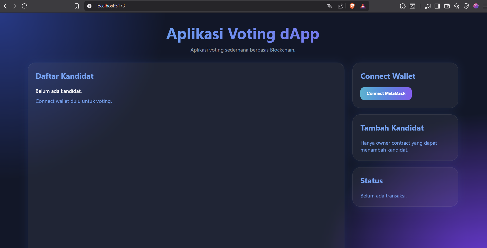

---

### 2. Wallet Connected

Menampilkan wallet MetaMask yang berhasil terhubung ke aplikasi.

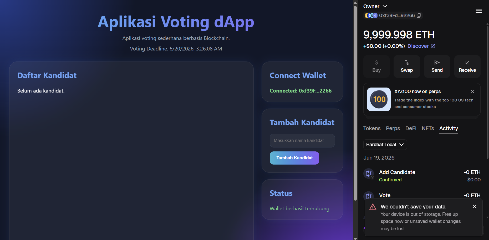

---

### 3. Add Candidate (Owner Only)

Owner berhasil menambahkan kandidat ke dalam sistem voting.

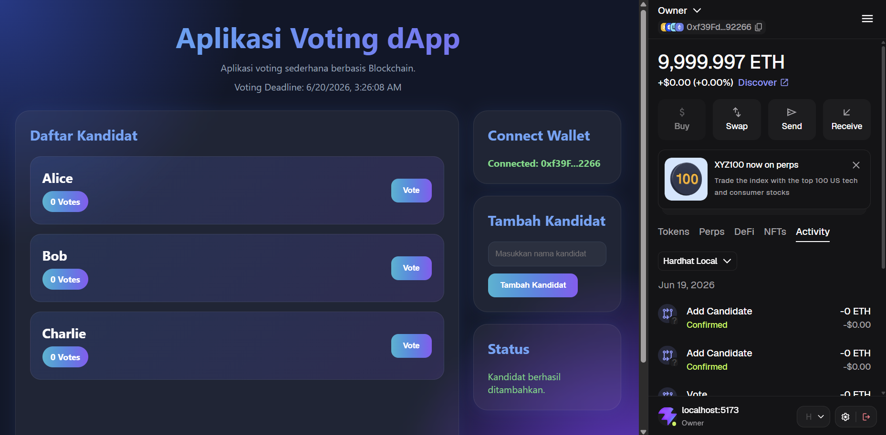

---

### 4. Voting Process

Pengguna melakukan voting terhadap salah satu kandidat. Dapat dilihat konfirmasi disertai permintaan transaksi dari MetaMask beserta biaya transaksi.

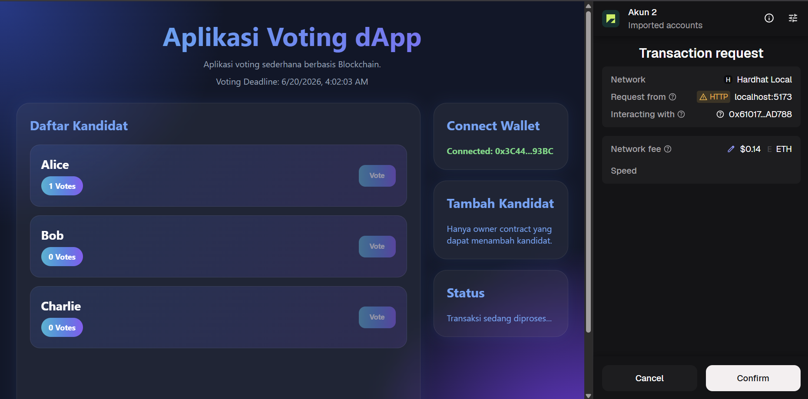

---

### 5. Double Vote Prevention

Setelah melakukan voting, wallet tidak dapat melakukan voting kembali. Dapat dilihat dari fitur disable tombol vote sehingga tidak akan terjadi pengulangan voting.

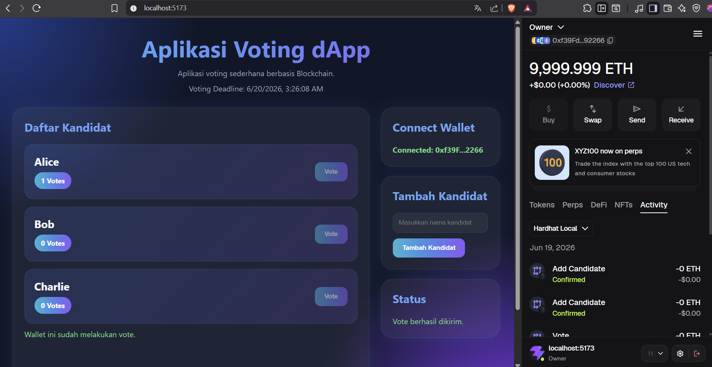

---

### 6. Non-Owner Restriction

Akun selain owner tidak dapat menambahkan kandidat. Terlihat dari bagian tambah kandidat yang tidak tersedia.

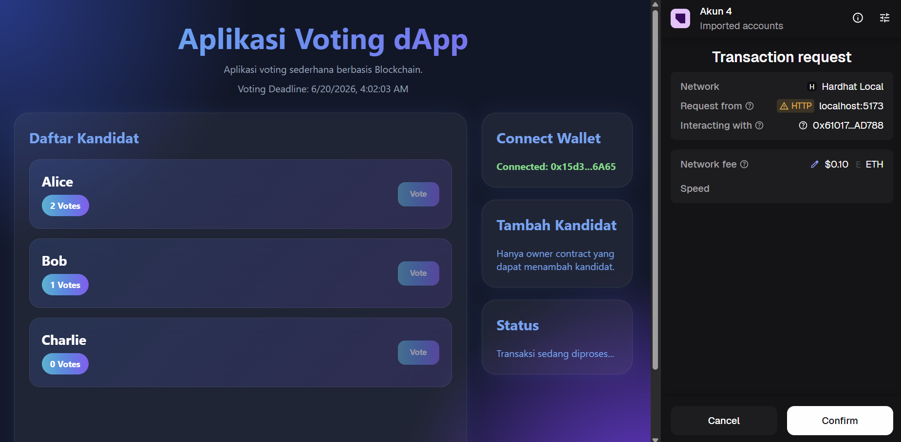

---

### 7. Network Detection

Aplikasi memberikan peringatan ketika pengguna berada pada network yang salah. Hal ini terjadi saat percobaan perubahan network ke Bitcoin Mainnet.

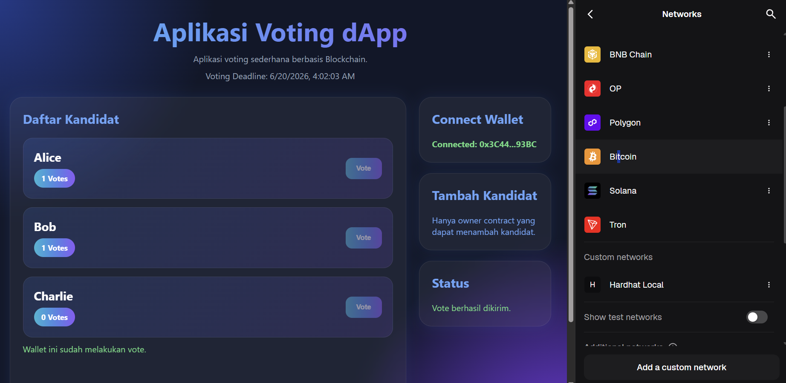

---

### 8. Voting Result

Menampilkan hasil voting dan jumlah suara setiap kandidat. Bisa dilihat setelah ada 3 suara yang masuk, yaitu 2 suara untuk Alice dan 1 suara untuk Bob.

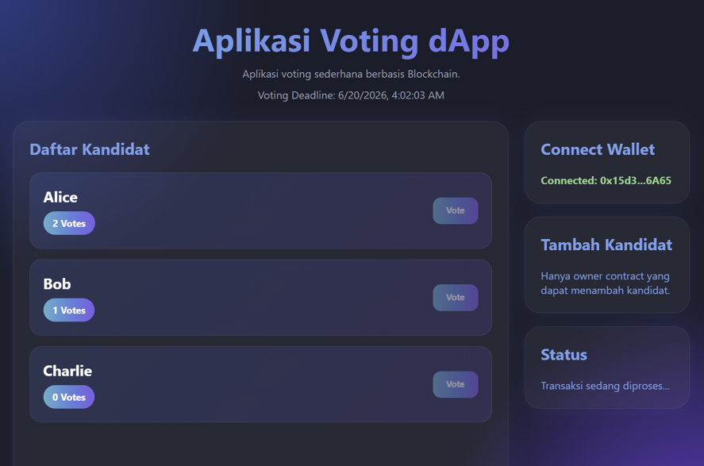

---

### 9. Smart Contract Testing dan Coverage Test

Seluruh test case smart contract berhasil dijalankan.

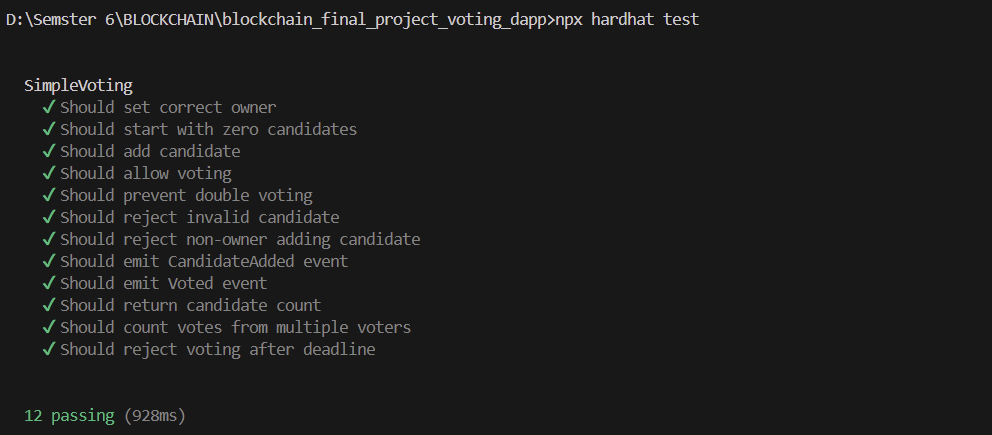

Selain itu Coverage Test juga telah menunjukkan hasil yang baik dengan branch coverage mencapai 100%.

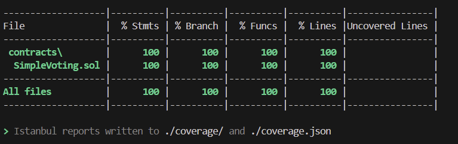

---

### 10. Responsive Design (Bonus)

Tampilan aplikasi pada perangkat mobile.

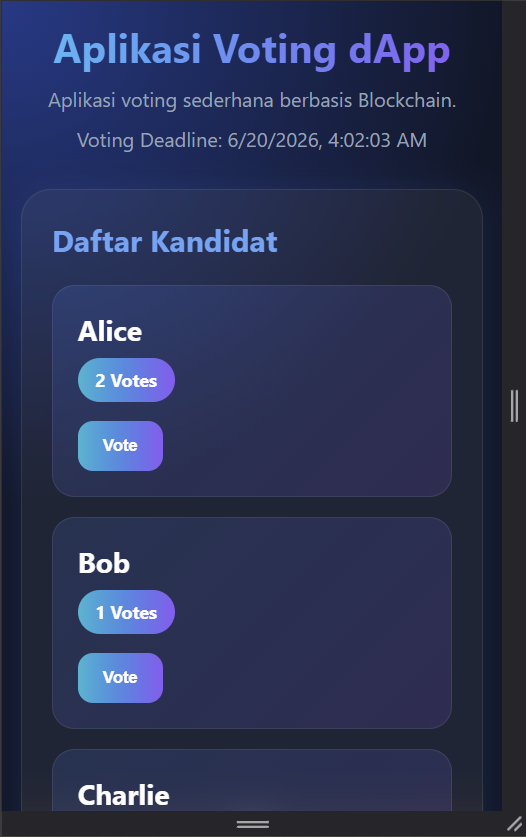
